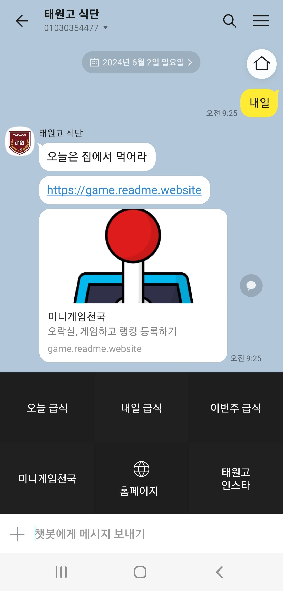
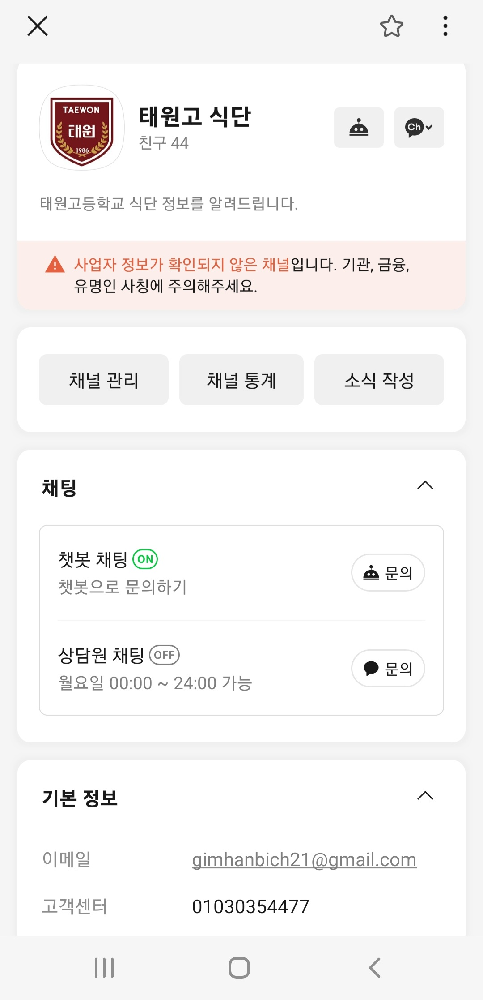

# 카카오톡 급식 챗봇 프로젝트


### 1.사용목적

```java
교내에서 급식을 먹는사람들을 위하여 급식 챗봇으로 미리 메뉴를 공지하여
더 편리하게 급식을 이용할수 있도록 만든다
```

### 2.기능

```java
기능으로는 먼저 오늘,내일,이번주,다음주 급식을 알려주도록 각각의 버튼이 있다.
다음기능으로는 학교 인스타로 들어갈수있는 하이퍼링크와 학교 홈페이지로 갈수있는
하이퍼링크가 있다.위 사진이 완성된 인터페이스 이다. 
```


### 3.개발 내용

```java
위에 같은 기초적인 구상 이후 개발에 들어갔다. 개발에서는 node와 my sql을
사용하기 위해 공부하며 기초적인 틀을 잡으며 위에서 작성한 기능을 맞춰나갔다.
중간중간 챗봇 개발중 스킬오류와 자동화 오류가 생겨 어떻게 하면 정상화 시킬수
있을지 고민하며 개발한결과 오류가 해결됬다. 오류 해결이후 하이퍼링크들을 달며
개발을 완료했다.
위 사진은 기본적으로 서비스를 이용할떄 필수적으로 거쳐야한다.
그래서 이공간을 직접 꾸미며 사용하기 편하게 만들었다.
```


### 4.개발소감

```java
직접 챗봇을 만들어보며 개발의 어려움을 느꼈고 또한 개발에서 어려운것에 대하여
직접 찾아가며 해결하는 재미 또한 있었다.중간중간 오류도 많았지만 다음에는
이런 오류가 생기지 않도록 꼼꼼하게 오류를 확인하며 해결하였다.
개발후 직접 친구들과 선생님들께 홍보하여 내 챗봇 사용자를 늘려나갔다.
이러한 경험이 날 더 나은 개발자로 만드는것 같아 좋았다.
```
